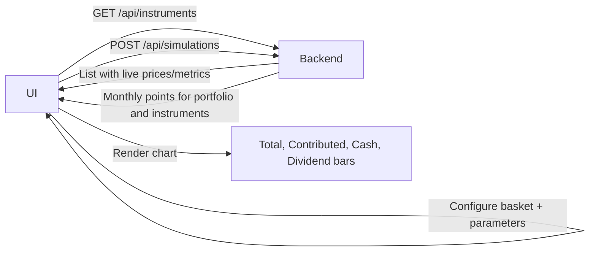

<div align="center">

# Forwardeal — Investment Basket Simulator

<br />


<br /><br />

Simulate long‑term investments on baskets of ISINs (stocks/ETFs) with DCA, dividend policies, fees and a modern chart. Clean, minimal, and fast.

<br />

</div>

---

## 🔎 Table of contents
- ✨ Features
- 🏗️ Architecture
- 🧠 Simulation model
- 🎛️ Parameters
- 🔁 Data flow
- 🚀 Run locally
- 📁 Structure
- 🧭 Example scenario
- ⚖️ License

---

<div align="center">

## ✨ Features

</div>

<br />

### 📈 Realistic simulation
| Feature | Description |
|---------|-------------|
| **ACGR-based growth** | 10-year compound annual growth rate |
| **Realistic volatility** | ~3 down months per year while respecting the ACGR |
| **DCA** | Amount, frequency, investments per period (first investment from month 0) |
| **Dividends** | Accumulating vs Distributing (bars for yearly sums) |
| **Fees** | Value-weighted (%/yr) auto-filled from expense ratios |
| **Nominal vs Real** | Toggle to see FR inflation impact |

<br />

### 🎓 Pedagogical interface (for beginners)
| Feature | Description |
|---------|-------------|
| **Detailed explanations** | For each calculation (return, gains, dividends) |
| **Monthly table** | With variation, DCA contributions, cumulative gains |
| **Clear distinction** | Yearly gains vs cumulative gains since start |
| **Visual counter** | X months up / Y months down per year |
| **Reinvested dividends** | Explained in each year's header |
| **Educational warnings** | Why DCA return ≠ market ACGR |

<br />

### 🔍 Search & display
- Search and sort instruments (by ACGR / A-Z)
- Real-time prices, automatic EUR/USD conversion

---

<div align="center">

## 🏗️ Architecture

</div>

<br />

### Backend (Java 21, Spring Boot 3)

| Endpoint | Description |
|----------|-------------|
| `GET /api/instruments` | Curated universe with `currentPrice`, `acgr10`, `dividendYieldAnnual`, `expenseRatioAnnual`, `dividendPolicy` |
| `POST /api/simulations` | Monthly time series for portfolio and each instrument |

> **Market data via `YahooFinanceProvider`**: price (Yahoo/Stooq, FX aware), ACGR from ~10y monthly log‑returns with fallbacks + CSV hints, dividend yield and expense ratio with conservative defaults on rate‑limit.

<br />

### Frontend (Vite + React + TypeScript + TailwindCSS + Recharts)

| Panel | Content |
|-------|---------|
| **Left panel** (scrollable) | Instruments, basket, parameters |
| **Right panel** (fixed) | Interactive composed chart with gradients, dashed cash curve, yearly dividend bars |

---

<div align="center">

## 🧠 Simulation model

</div>

<br />

### 📊 Realistic volatility

Monthly returns are **not constant** — they simulate real market volatility:

| Property | Value |
|----------|-------|
| Negative months per year | ~3 |
| Monthly volatility | ~4% (typical for equity markets) |
| Annual result | Product of 12 monthly returns = exactly the annual ACGR |

```
Example for ACGR = 10%/yr:
Jan: +2.1%, Feb: -1.8%, Mar: +3.2%, Apr: -0.5%, May: +1.9%, ...
→ Final product = 1.10 (10% annual respected)
```

<br />

### 📐 Formulas

| Formula | Expression |
|---------|------------|
| Monthly nominal return | `r_m = (1+ACGR)^(1/12) - 1` (base, then variance added) |
| REAL mode | `r_m^real = (1+r_m)/(1+i_m) - 1` with `i_m = (1+inflation)^(1/12) - 1` |
| Monthly fees | `f_m = (1 - fee_yr)^(1/12) - 1` |
| Price update | `price *= (1 + r_volatile) * (1 + f_m)` |

<br />

### 💰 DCA (Dollar-Cost Averaging)

| Rule | Description |
|------|-------------|
| First investment | Made at month 0 (January of year 1) |
| Frequency | According to chosen frequency (monthly/quarterly/yearly) |
| Allocation | Equal split if initial quantities = 0, otherwise proportional to quantities |

<br />

### 🪙 Dividends

| Type | Behavior |
|------|----------|
| **Accumulating** | Dividends automatically reinvested (included in value) |
| **Distributing** | Dividends tracked separately for display |

> ACGR already includes total return (price + dividends)

<br />

### 📚 Pedagogical display
- **Yearly gains** vs **Cumulative gains** clearly distinguished
- Explanation of each metric calculation
- Up/down months visually counted

---

<div align="center">

## 🎛️ Parameters

</div>

<br />

| Parameter | Description |
|-----------|-------------|
| **Basket** | ISIN + quantity at t0 (can be 0) |
| **Years** | Investment horizon |
| **DCA schedule** | Amount / frequency (M/Q/Y) / investments per period |
| **Fees** | %/yr (basket‑level; UI auto‑fills with weighted average of instruments' expense ratios) |
| **Side capital** | Cash included in Total, not invested, shown as real cash curve |
| **Real vs Nominal** | Toggle |

---

<div align="center">

## 🔁 Data flow

</div>

<br />



1. UI calls `GET /api/instruments` → shows list with live prices/metrics
2. User configures basket + parameters → `POST /api/simulations`
3. Backend returns monthly points for portfolio and instruments
4. UI renders Total, Contributed, Cash (real), and yearly dividend bars

---

<div align="center">

## 🚀 Run locally

</div>

<br />

### Prerequisites

| Tool | Version | Link |
|------|---------|------|
| **Java** | 21 | [Download](https://www.oracle.com/java/technologies/downloads/#java21) |
| **Maven** | or Maven Daemon (mvnd) | [mvnd recommended](https://github.com/apache/maven-mvnd/releases) (2-10x faster) |
| **Node** | 18+ | For frontend build |

<br />

### Launch (monolithic architecture)

The frontend is compiled and served directly by the Spring Boot backend on the **same port**.

```bash
# With Maven Daemon (recommended, faster)
mvnd spring-boot:run

# OR with classic Maven
mvn -q -DskipTests spring-boot:run
```

> 📍 **Application available at**: http://localhost:8080

> The React frontend is automatically copied to `target/classes/static/` during Maven build.

<br />

### Frontend build (if modifications)

```bash
cd frontend
npm install        # first time only
npm run build      # generates dist/
```

Then restart `mvnd spring-boot:run` to integrate changes.

<br />

### Swagger UI (API documentation)

> 📖 http://localhost:8080/swagger-ui/index.html

---

<div align="center">

## 🧰 Tooling — what and why

</div>

<br />

<details>
<summary><strong>🔧 Maven / Maven Daemon</strong> (backend build & run)</summary>

| | |
|-|-|
| **What** | The de‑facto Java build tool and dependency manager. **Maven Daemon (mvnd)** is an optimized version that keeps a JVM running in background for 2-10x faster builds. |
| **Why** | It fetches Spring/HTTP/validation libraries, compiles the code, and runs the app via the Spring Boot Maven Plugin. |
| **Commands** | `mvnd spring-boot:run` (recommended) or `mvn -q -DskipTests spring-boot:run`, `mvn package` |
| **Install mvnd** | [github.com/apache/maven-mvnd/releases](https://github.com/apache/maven-mvnd/releases) |

</details>

<details>
<summary><strong>🟢 Node.js</strong> (frontend runtime & tooling)</summary>

| | |
|-|-|
| **What** | A JavaScript runtime used to execute tooling (npm) and dev servers. |
| **Why** | To install packages (`npm install`), run the Vite dev server (`npm run dev`) and build the React UI for production. |
| **Commands** | `npm install`, `npm run dev`, `npm run build` |

</details>

<details>
<summary><strong>📘 Swagger / OpenAPI</strong> (API docs & testing)</summary>

| | |
|-|-|
| **What** | Interactive documentation UI generated from the backend's OpenAPI spec. |
| **Why** | To explore and test REST endpoints without writing a client; it shows request/response schemas and sample payloads. |
| **Open** | `http://localhost:8080/swagger-ui/index.html` once the backend is running |

</details>

<details>
<summary><strong>🌐 Spring Web</strong> (REST layer)</summary>

| | |
|-|-|
| **What** | The Spring MVC stack for building HTTP APIs (controllers, routing, JSON serialization). |
| **Why** | To expose `/api/instruments` and `/api/simulations`, handle validation errors, and configure CORS for the frontend. |
| **Where** | `com.example.forwardeal.api.*` controllers |

</details>

<details>
<summary><strong>✅ Validation</strong> (Jakarta Bean Validation)</summary>

| | |
|-|-|
| **What** | Annotation‑based validation (`@NotBlank`, `@PositiveOrZero`, `@Valid`, etc.). |
| **Why** | To validate `SimulationRequest` and nested records safely before running the simulation. |
| **Benefit** | Concise, declarative constraints with automatic 400 responses on violations |

</details>

<details>
<summary><strong>📄 springdoc OpenAPI</strong> (spec generation)</summary>

| | |
|-|-|
| **What** | A Spring integration that generates an OpenAPI spec from controllers and schemas. |
| **Why** | To drive Swagger UI and keep API docs in sync with the code. |
| **Result** | Typed request/response models based on our Java records |

</details>

<details>
<summary><strong>⚡ Vite</strong> (frontend dev server & bundler)</summary>

| | |
|-|-|
| **What** | A fast dev server with HMR and a modern bundling pipeline. |
| **Why** | Instant feedback during development and optimized builds for production. |
| **Commands** | `npm run dev`, `npm run build` |

</details>

<details>
<summary><strong>🔷 TypeScript</strong> (typing for the UI)</summary>

| | |
|-|-|
| **What** | A typed superset of JavaScript. |
| **Why** | To model API DTOs, chart rows, and component props with compile‑time safety. |
| **Outcome** | Fewer runtime bugs and clearer contracts between UI and API |

</details>

<details>
<summary><strong>🎨 Tailwind CSS</strong> (styling)</summary>

| | |
|-|-|
| **What** | A utility‑first CSS framework. |
| **Why** | To implement a minimal, modern dark UI quickly (spacing, colors, typography, responsive) without writing custom CSS files. |
| **Extras** | Custom scrollbars and gradients via utilities |

</details>

<details>
<summary><strong>📊 Recharts</strong> (charting)</summary>

| | |
|-|-|
| **What** | A React chart library based on SVG. |
| **Why** | To compose Area + Bar series, custom gradients, dual axes, and rich tooltips for the portfolio evolution. |
| **In this app** | Total & Contributed (areas), Cash (dashed), Yearly dividends (bars) |

</details>

---

<div align="center">

## 📁 Structure

</div>

<br />

```
src/main/java/com/example/forwardeal   # Backend (API, domain, services, provider)
src/main/resources/universe/           # Curated instrument CSVs with optional ACGR hints
frontend/                              # React + Vite UI
docs/                                  # Documentation assets (add simulation-example.png here)
```

---

<div align="center">

## 🧭 Example scenario

</div>

<br />

### Simulation: €2,000/month on MSCI World for 4 years

| Step | Action |
|------|--------|
| 1 | **Add** "iShares MSCI World ETF" to basket (initial quantity = 0) |
| 2 | **Configure**: DCA €2,000/month, Monthly frequency, 4 years horizon |
| 3 | **Run** the simulation |

<br />

### Expected result (ACGR ~10%/yr)

| Metric | Value |
|--------|-------|
| 💰 Total invested | €96,000 |
| 🎯 Final value | ~€116,000 |
| ✨ Total gains | ~€20,000 (+21%) |
| 📈 Average annual return | ~4.8%/yr* |

> *Personal return (~4.8%) is lower than market ACGR (10%) because with DCA, your money isn't invested for the entire duration. The first contribution benefits from 4 years of growth, but the last one only a few months.

<br />

### 📊 A realistic chart

With the option to account for inflation (Nominal ⇒ Real)!

| Feature | Description |
|---------|-------------|
| 📊 **Realistic volatility** | ~3 down months per year (red) |
| 💜 **Reinvested dividends** | Displayed in each year's header |
| 📈 **Cumulative vs Yearly gains** | Clearly distinguished |
| 💡 **Pedagogical explanations** | Detailed calculations for each metric |


<br />

### 📋 A perfectly detailed data grid for each year

<table>
<tr>
<td><strong>Header - Global</strong></td>
<td><strong>Year 1 - Detailed</strong></td>
<td><strong>Year 4 - Bottom</strong></td>
</tr>
<tr>
<td></td>
<td></td>
<td></td>
</tr>
</table>

<br />

### 📄 Export it — clear PDF!


---

<div align="center">

## ⚖️ License

**MIT**

</div>

---

<div align="center">

## 🖥️ Desktop packaging (.exe)

**How it works**

</div>

<br />

This project ships as a Spring Boot backend plus a React frontend. We can package both into a single desktop application for Windows using `jpackage` (Java 21+) and Maven.

<br />

### What the .exe does

| Feature | Description |
|---------|-------------|
| **Embedded Java** | Starts an embedded Java runtime with your Spring Boot server (port 8080 by default) |
| **Bundled frontend** | React frontend is prebuilt and copied into Spring's `static/`, served at `http://localhost:8080/` |
| **Shortcuts** | Desktop and start menu entry with a custom icon |

<br />

### Build steps (Windows)

> **Prereqs**: Java 21 with jpackage (included in recent JDKs), Maven, Node 18+

<br />

**1️⃣ Build the backend and frontend together**

```bash
mvn -q -DskipTests package
```

This will:
- Run the frontend build (`frontend/` → `dist/`)
- Copy the `dist/` assets into `target/classes/static`
- Assemble a Spring Boot runnable jar at `target/forwardeal-<version>.jar`

<br />

**2️⃣ Produce the Windows installer (.exe) with jpackage**

```bash
mvn -P windows -Dicon="path/to/icon.ico" org.panteleyev:jpackage-maven-plugin:jpackage
```

Outputs an installer under `target/jpackage/Forwardeal-<version>.exe`.

<br />

**3️⃣ Install & launch**

- Run the generated `.exe` and follow the wizard
- A "Forwardeal" shortcut will be added to the desktop/start menu
- Double‑click to launch. The app starts the backend and serves the UI at `http://localhost:8080/` in your default browser

<br />

### Notes & customization

| Setting | How to change |
|---------|---------------|
| **Port** | Edit jpackage `jvmArgs` in `pom.xml` or provide `-Dserver.port=XXXX` |
| **Icon** | Pass `-Dicon=...` to jpackage; must be `.ico` on Windows |
| **Auto‑open browser** | Create a `startup.bat` that starts the exe then opens `http://localhost:8080/` |
| **Mac/Linux** | Change jpackage type (`dmg`, `pkg`, `deb`, `rpm`) |

---

<div align="center">

Made with ❤️ by the Forwardeal team

</div>
